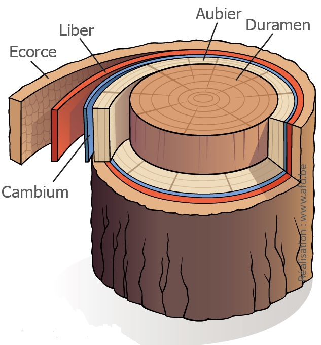
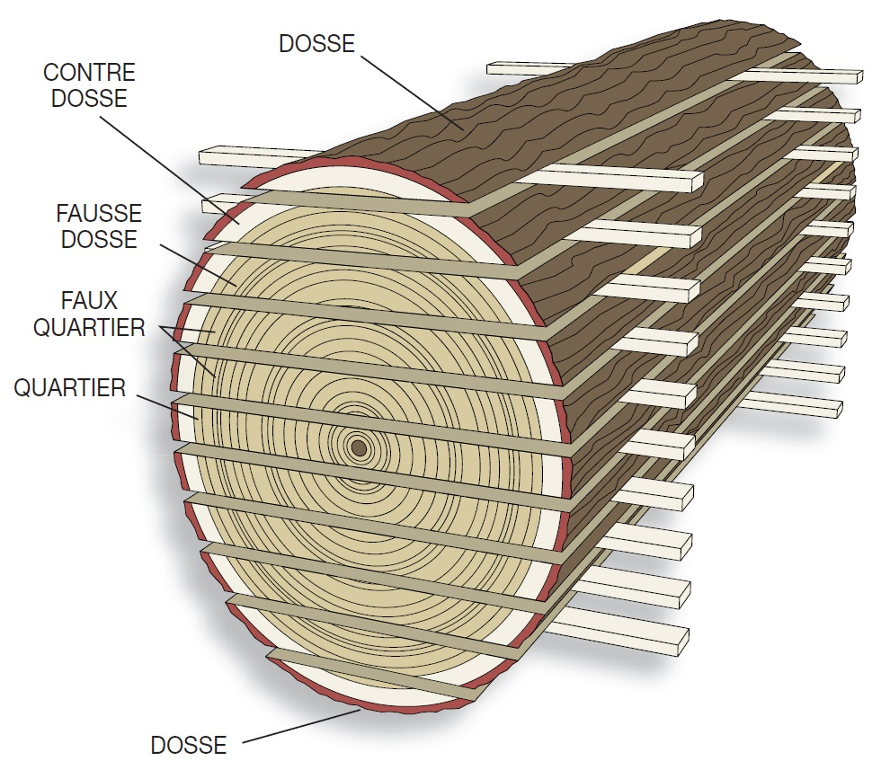

# Bois

## Essences

| Essence  | Notes                                         |
|----------|-----------------------------------------------|
| Résineux | Légers, moyennent solide.                     |
| Frêne    | Recommandé : se travaille bien, assez solide. |
| Hêtre    | Plus homogène que le Frêne, mais bouge plus.  |
| Peuplier | Bois peu solide (allumettes)                  |

## Panneaux de bois

Ils sont chargés en colles.

| IMPORTANT : Ne pas utiliser sur certaines machines (e.g. scie à ruban) car il désafutent rapidement. |
| --- |

* **Contreplaqué** : plusieurs **plis**, en nombre impair, collées avec leurs fils croisés.
* **Latté**: des lattes de bois reconvertes sur leurs deux faces de **plis** de placage.
* **Lamellé-collé**: collage de plusieurs lamelles avec leurs fils essentiellement parallèles.

### Panneaux de particules.

Par taille décroissante de particules :
* **OSB**
* **Aggloméré**, et **Mélaminé** lorsqu'il est recouvert d'un papier imprégné de résine.
* **MDF**, aussi appelé **Medium**. A noter qu'il existe aussi en haute densité (**HDF**).

## Théorie

Les différentes parties du tronc :

<figure>
  
  <figcaption>source: afd.be</figcaption>
</figure>

Au centre, il y a aussi la **moëlle**, ou **coeur**, à éviter car c'est la partie où il y a le plus de tensions et de noeuds.

L'**aubier** est aussi à eviter. Il s'agit de la partie dans laquelle redescend la sève chargée en sucre suite à la photosynthèse. Elle est plus suceptible aux parasites (champignons et insectes).

| IMPORTANT : L'aubier n'est pas distingué dans toutes les essences. S'il n'est pas visible, on peut le garder. |
| --- |

Le **durament** est la partie que l'on utilise.

Les **cernes** du bois sont dues à la différence de diamètre et de densité des cellules entre hivers (plus larges) et été (plus denses).

---

Après abattage, on prend les planches dans la **bille**, qui est la partie du tronc sans branches.
Au dessus se trouve la **surbille** (au dessus du premier gros défaut), avec les branches et feuillages.

Le débit de la bille en plot :

<figure>
  
  <figcaption>source: lairdubois.fr</figcaption>
</figure>

> **NOTE** : Il semble que les **dosse**, **contre-dosse** et **fausse dosse** soient parfois toutes appelées **dosses**.

Les planches prises dans la **dosse** vont se déformer le plus (les cernes vont avoir tendance à se redresser). Le **quartier** va donner les planches les plus stables, mais impose de se débarasser du **coeur**.

## Mouvement du bois

Le bois se contracte par séchage, et se dilate lorsqu'il absorbe de l'humidité. Le mouvement est le plus fort perpendiculairement au fil.

Les panneaux particules (agglo, MDF) eux bougent beaucoup moins, et de façon plus homogène.

## Notes sur la résistance des structures

Dans un plan, la résistance à une force augmente linéairement avec la dimension perpendiculaire à la force.
Elle augment **au cube** avec la dimension colinéaire.

> **Exemple** : Pour le poids, la résistance d'une traverse à la flexion augmente linéairement avec sa largeur, mais au cube avec sa hauteur.
