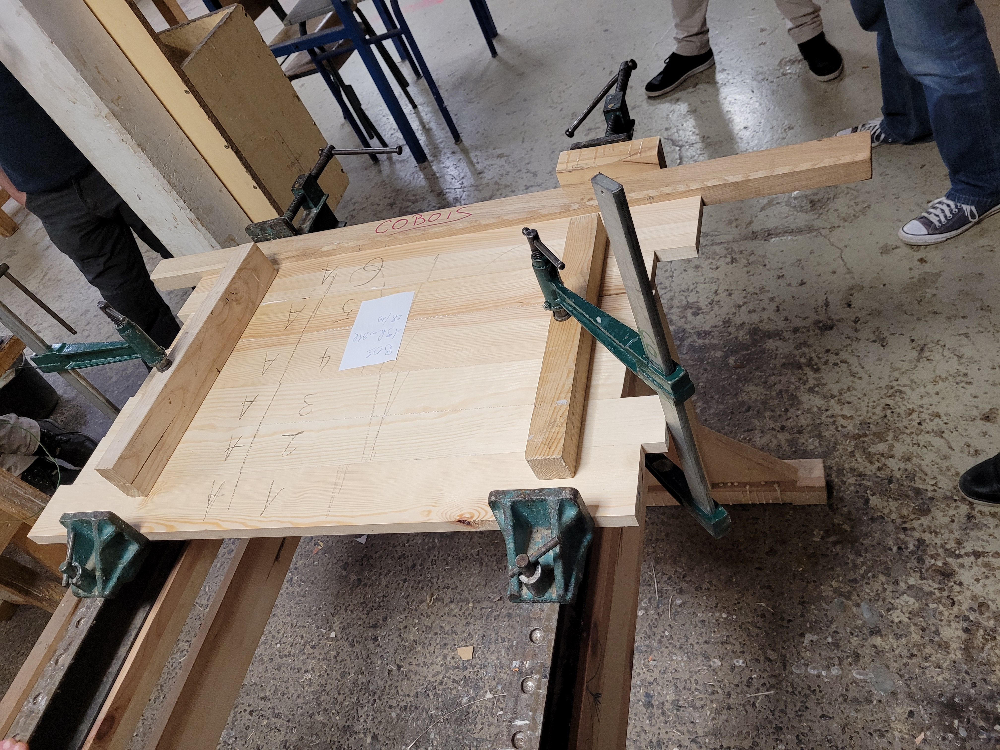
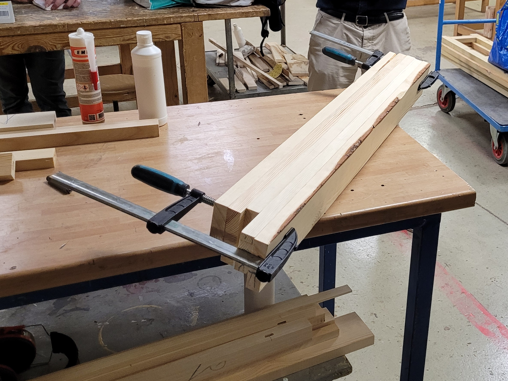
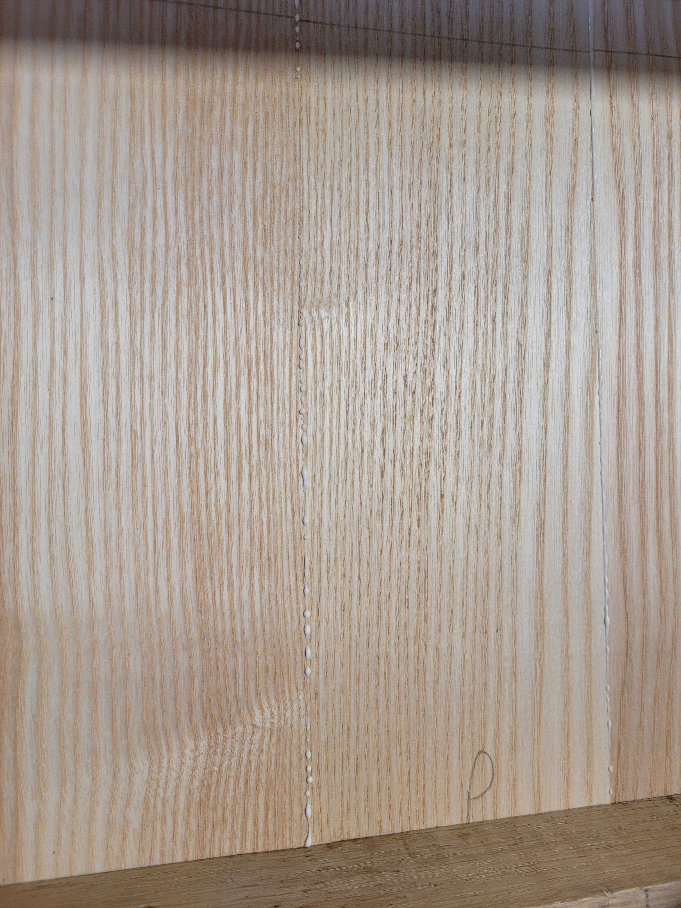
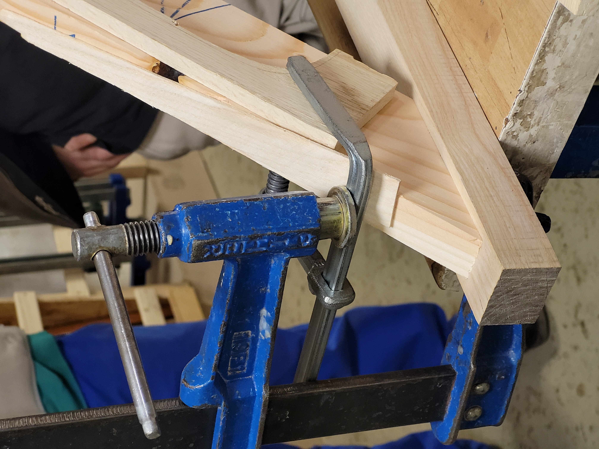

# Collage

## Types de colles

* Polyuréthane: Un peu élastique, elle permet donc un certain jeu (qui peut être nécessair si les assemblage peuvent jouer avec l'humidité).
* Polyvinylique: "Colle blanche", à favoriser. Il existe D1, D2, D3, par ordre croissant de force de collage, mais par ordre décroissant de **temps ouvert**.

## Procédures pour coller

Ecartement des dormants :
  * Pour **un panneau**, ils doivents êtres proche du bord, afin de pouvoir serrer les calles transversales.
  * Pour **un cadre**, les dormants doivent être en faces des traverses.

Mettres les dormants parallèles en utilisant le mètre au deux extrémités.

Vérifier le gauche des dormant en lorgnant et en parcourant la ligne de chacun des dormants. Se tenir la tête pour limiter les mouvement involontaires.

> :warning: **TIP** Toujours faire un assemblage à blanc (sans colle) complet avant, incluant les serres joints. Tout sera en place comme ça au moment de coller.

> **TIP** Les calles parallèles (parallèles aux planches, en contact avec les dormants) sont optionnelles. Normalement un panneau doit être recoupé par le suite ! (pas besoin de protéger).

> :warning: **TIP** N'encoller qu'un seul chant par joint. Cela evite les sur-épaisseurs, et simplifie les manipulations propres.

> :warning: **TIP** Scotcher les calles en place lorsqu'on manque de mains.

| IMPORTANT : Orienter le cintrage des calles pour assurer une surface d'appui maximale. |
| --- |

| IMPORTANT : Paraffiner avant tout ce qui ne doit pas être collé (dormants, calles). Surtout si on colle au polyuréthane. |
| --- |

### Coller un panneau

* Bien marquer le panneau sur le parement. La numérotation complète (différencier le 9), et le trait continue mais qui ne vas pas au deux bords.
  

* Tourner toutes les planches avec le chant qui va être encollé contre une table, les saisir entre deux presses, et retourner.
  

* Encoller d'un coup tous les champs qui sont ainsi bien alignés.

  > **TIP** Encoller les chants avant de mettre les lamellos.
  > Etaler une couche de colle pas trop épaisse, mais qui blanchit tout le chant.

  > **TIP** Mettre du papier est déconseillé pour la colle blanche. Elle n'adhère pas au métal, les éventuelles marques partent au ponçage. En revanche du papier qui se coince dans un joint par difficilement.

  La bonne quantité de colle vient légèrement perler une fois le serrage effectué.

  

* Assembler:
  * placer les chants côte à côte un par un sur les dormants
  * mettre les presses des dormants au contact
  * mettres les calles transversales (qui évitent le cintrage) et leur serre joint au contact
  * serrer les presses des dormants
  * serre les serres joints des calles transversales.

* Vérifier le gauche : regarder si le panneau est bien en contact tout le long des dormants (en particulier aux coins). Donner un coup sec de marteau **avec calle** si besoin.

* On peut venir rajouter des serres-joints parallèles aux dormants.

  | IMPORTANT : Les barres des serres joints au contacts des calles ou du panneau. Serrer modérément. |
  | --- |

  

### Coller un cadre

* Serrer au niveau des traverses (et pas entre).

  > **TIP** Il est possible de coller plusieurs cadre identiques dans les mêmes dormants.

* Au fur et à mesure du serrage :

  * vérifier l'équerrage du cadre.

    > :information_source: **TECHNIQUE pour vérifier l'équerrage d'un cadre** :
    > Mesurer les deux diagonales, reporter les dimensions relative sur les doigts type "cadre de visée", observer quelle correction doit être apporter pour aller vers l'équerre.

  * vérfier le gauche (i.e. que les cadres restent bien au contact des dormants). Donner un coup sec de marteau avec la calle si besoin.

### Coller un angle

> :information_source: **TECHNIQUE pour serrer un angle quelconque avec un serre-joint** :
> Faire un assemblage avec une presse qui prend le morceau coupé à l'angle (mettre des calles),
> puis utiliser la barre de la presse comme un des appuis-du serre joint.
> 
