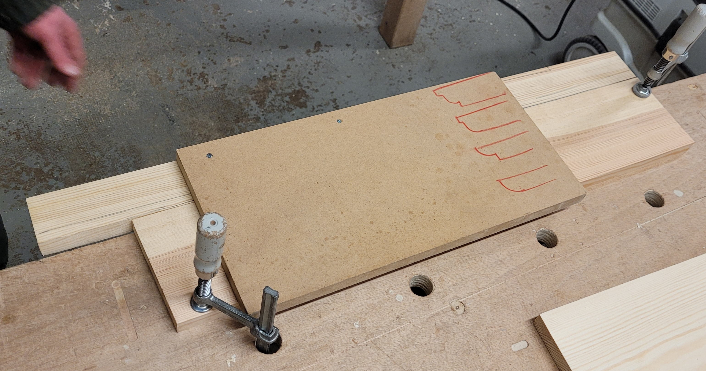

# Défonceuse

* **Affleureuse**: Plus petit moteur (donc plus légère), une seule coulisse, ne peut pas plonger (s'utilise avec une profondeur fixée avant le démarrage).

* **Defonceuse**: Moteur plus puissant, deux coulisses, peut plonger pendant l'usinage.

## Utilisation

### Montage de la fraise

* Laisser dépasser environ 4mm de metal brillant au serrage.
Il y a parfois un signe indiqué sur la queue de la fraise `>|`.

### Pointage (Réglage de la profondeur)

#### Profondeur de passe

* Venir faire le zéro en plongeant jusqu'à ce que les tranchant de face touche la pièces, et bloquer le taquet.

* Espacer le taquet vers le haut à partir de là pour augmenter la profondeur. (par exemple, en utilisant des cales d'épaisseur connue).
  

### La vitesse de travail

Le plus ça tourne vite, le mieux l'outil va couper.
Toujours commencer à vitesse maximale, sauf pour les très grosses fraises.

> **TIP** Il n'y a d'intérêt à baisser la vitesse que si la fraise vibre, ce qui s'entend.
C'est le déséquilibre de la fraise qui entraîne des vibrations, c'est donc plus présent sur les fraises très larges ou longues.

### Usinage

> **TIP** Commencer par le travers (bois de bout).

* Bien se positionner sur ses appuis, garder la poignée sans la gachette sur la pièce.
  

* Démarrer **en dehors** du bois.

* La séquence polyvalentes, à exécuter rapidement :
  1. Démarrer la machine
  2. Plonger
  3. Verrouiller
  4. Avancer

| IMPORTANT : Il y a un sens d'usinage à respecter. |
| --- |

| IMPORTANT : Toujours bouger, ne pas rester sur place pour éviter de brûler le bois. |
| --- |

> :information_source: **TECHNIQUE pour éviter l'éclatement en sortie lorsqu'on traverse plein bois** :
> il est possible de venir pré-trouer l'autre côté en plongeant la fraise.

> **TIP** Le rond de la semelle est un cercle centré sur l'axe de la fraise.
Si on travaille en suivant un gabarit même rectiligne, utiliser le rond de la semelle permet de n'avoir aucune erreur en cas de rotation de la défonceuse (ce qui aurait un impact si appui contre le plat de la semelle).

#### Sens d'usinage

* Allez contre le sens de rotation de la fraise:
  * Si parcours d'un bord extérieur, tourner dans le sens anti-horaire.
  * Si parcours d'un bord intérieur, tourner dans le sens horaire.

* Si traversée en plein bois (i.e au bilan la fraise ne fournit pas d'effort dans le sens d'avancée):
  * S'assurer que la fraise vienne plaquer contre un gabarit éventuel.

## Les fraises

Choisir des fraises avec tranchants frontaux : cela permet de plonger dans le bois.

| IMPORTANT : La coupe frontale est moins propre et casses les arrêtes. |
| --- |

> **TIP** Pour une feuillure, qui va utiliser les couples latérales et frontales, faire la coupe frontale sur l'arrête cachée.

## Assemblages

### Gabarit T

Assemblage constitué d'un tasseau avec deux bord parallèles et droits, et d'une planche avec un bord droit et un côté à angle droit.
Visser en affleur d'un bord du tasseau le bord droit de la planche.

* Le `T` permet d'usiner une rainure à angle droit d'un bord de la pièce.
  * Venir positioner le bord intérieur du tasseau contre une pièce à usiner, puis suivre le côté de la planche à angle droit.
    

* En usinant aussi le tasseau, cela marque la position ce passage exacte de la fraise.
  

### Etagère toute simple

* Creuser des encoches sur les montant : utiliser un [`T`](#gabarit-t) pour faire des usinage perpendiculaires au bord long des montant.

> :information_source: **TECHNIQUE** :
> Faire les encoches en une seule passe, puis venir raboter l'étagèe à la largeur de l'encoche.

> **TIP** Il est possible de faire une encoche pour une étagère sur les deux montants en même temps. Gain de temps, et surtout garanti d'être à la même hauteur !
