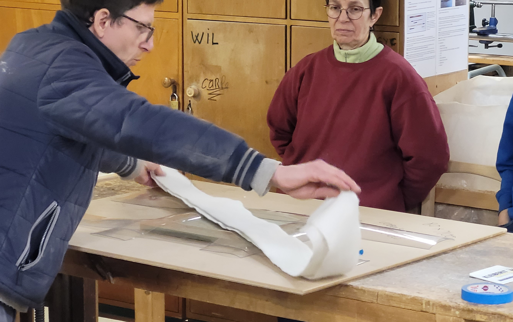
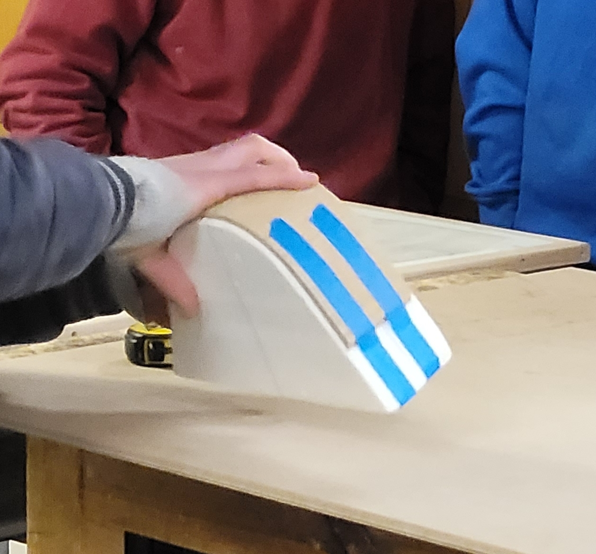
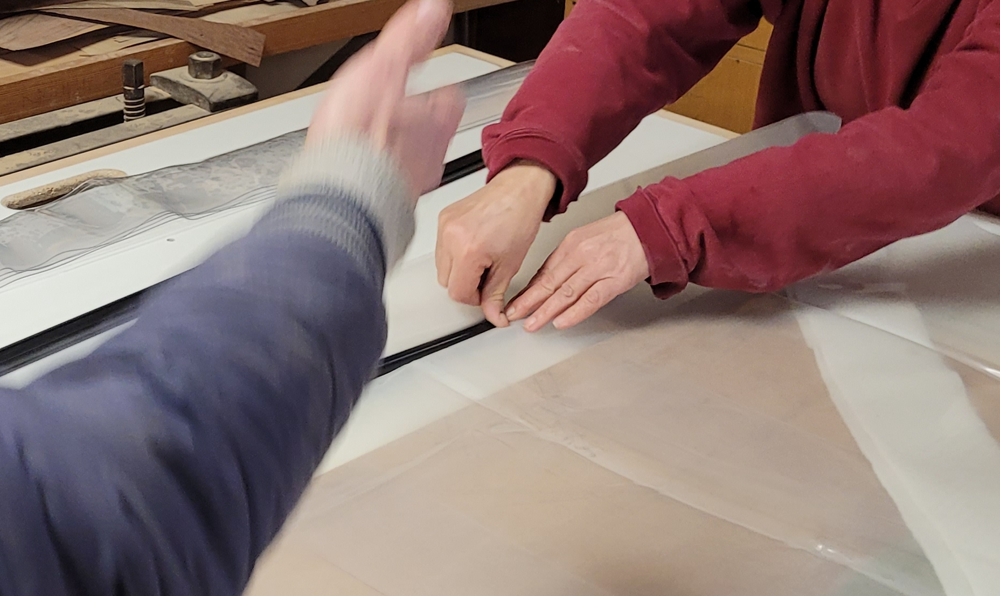
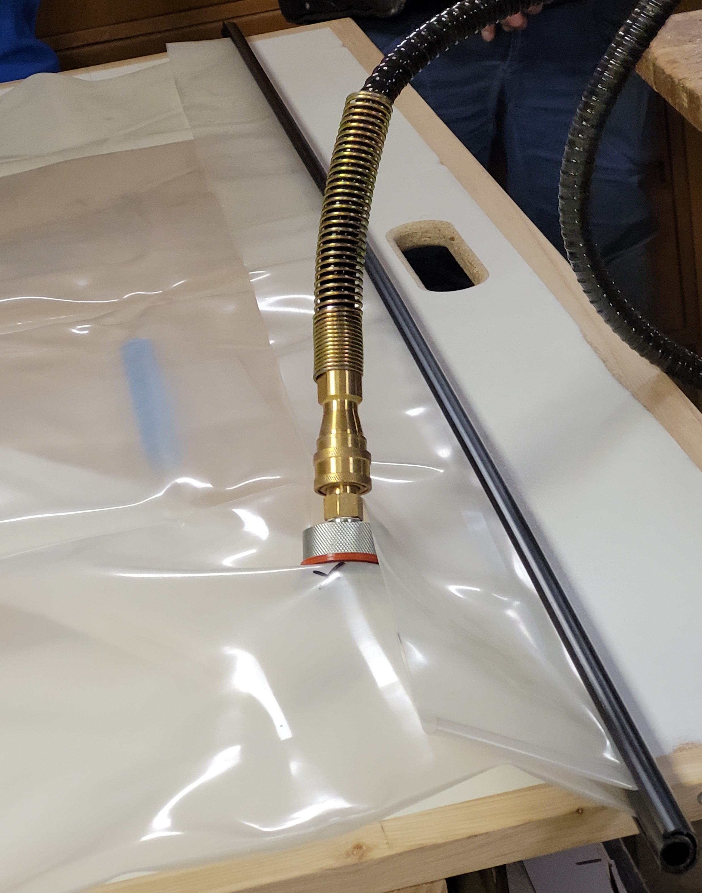

# Presse à vide

La presse à vide permet d'effectuer des placages, et de pièces courbées.
Les pièces courbées doivent être constituées d'un empilement de placages fins.

## Utilisation

### Mise en place

#### Placage

* Etaler la colle sur la pièce à plaquer. Utiliser un racloir avec des "dents" pour une quantité de colle uniforme.
  * Réserver un témoin de colle à l'air libre (permet de savoir quand c'est sec).
* Tout installer **centré** sur une grande plaque, le placage vers le bas. (Le placage étant plus large, il casserait sur le arrête du bois s'il était dessus). Composition :
  * La plaque
  * Une feuille de journal au cas où de la colle traverserait.
  * La pièce de bois à plaquer
  * Les protections en plastique transparent sur les arrêtes de la pièce (adouci les arrêtes, et évite de dégouliner la colle sur la poche)
  * Le drain en tissu, dont une extrémité devra se retrouver sous le raccord du tuyau.

Note: On peut utiliser du scotch (e.g. scotch bleu de peintre) pour maintenir en position.

#### Pièce courbée

* Réaliser un moule à la forme adaptée. Faire des moules pleins (risque de casse). Préférer les forms convexe.
* Protéger le moule (e.g. journal) pour pouvoir le ré-utiliser.
* Encoller les différent placages, les placer un à un centrés sur le moule.
* Utiliser du scotch pour maintenir la forme sur le moule.
* Placer au centre d'une plaque.
* Mettre en place les protections en plastique transparent, et le drain en tissu.

### Mise sous vide

* Installer le plateau sur les presses à vis.
* Venir glisser la plaque avec la pièce dans le sac.
  * On peut utiliser des pinces pour tenir le sac en place.
* Fermer le sac au deux extrémités avec le système de baguettes :
  * Placer la baguette femelle le long de l'ouverture, à ~10 cm du bord.
  * Venir enfoncer la baguette mâle, en commençant depuis un côté et en progressant vers l'autre.
  * S'assurer de ne pas venir créer de plis. En cas de plis, séparer les baguettes et recommencer.

* Installer le tuyau entre le raccord sur le sac, et la pompe.

* Le manomètre de la pompe vissé au maximum correspond à une dépression maximum, donc **dévisser** le manomètre.
* Dès le branchement de la fiche, la pompe démarre.
  * Marroufler à la main pendant que le vide se fait, en particulier sur les surface arrondies.

### Rangement

* Dévisser le raccord sur le sac.
* Replier le sac selon les plis.
