# Tournage

## Présentation

En plus des tours, Cobois met à disposition les équipements nécessaires à leur utilisation :
* 5 boîtes de gouges
* outils (centreurs, mandrins, ...)
* visière de protection

### Anatomie d'un tour à bois

### Les gouges

Le **talon** de la gouge est la surface derrière le tranchant.

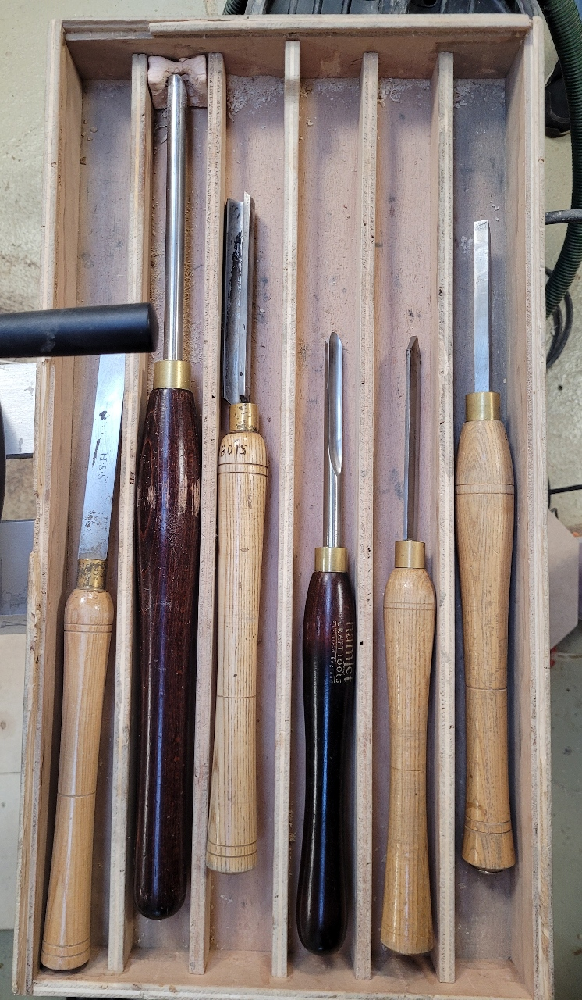

De gauche à droite :
* ?
* **Gouge à creuser**
* **Gouge à dégrossir** (beaucoup de métal) : pour dégrossir et mettre à rond. S'utilise à 45° (plan vertical).
  > :warning: S'utilise seulement en bois de fil, **jamais** en bois de bout (l'insertion dans le manche est fragile).
* **Gouge à profiler** (talon à angle important) : permet de façonner les profils (tores et gorges).
* **Tronquoir** : pour tronquer / tronçonner. S'utilise sur la tranche, en tronçonnant, en commençant à 45° et en remontant le manche presque à l'horizontale.
* **Bédane** : s'utilise à l'horizontale. Mettre le porte outil 1cm en dessous de l'axe.

> :warning: Lorsqu'on utilise le tronquoir ou le bédane pour faire un "saignée", toujours l'élargir un peu, plus large que l'outil pour éviter de le bloquer.

## Fonctionnement et Réglages

### Tour de marque Bezombes

L'arrêt se fait en mettant l'interrupter de choix du sens de rotation (en bas en droite)
sur la position 0.

### "Petit" tour

> :warning: Toujours mettre la bague **avant** la pointe (pour permettre son démontage),
il n'y a pas de passage pour une tige.

### Vitesse de tournage

**Une vitesse plus haute offre une meilleure coupe.**

Il n'y a pas de règle pour déterminer une vitesse exacte à appliquer,
il faut apprécier plusieurs paramètres et eventuellement adapter la vitesse.

> **TIP** Une vitesse de 1500 tours/minute est adaptée pour les pièces moyennes accessible aux débutants (ex. pilon).

* Haute vitesse:
  * Pièces à faible diamètre (la vitesse linéaire étant proportionnelle au diamètre)

* Faible vitesse:
  * Pour les grosses pièces (en particulier grand diamètre)
  * Pièces avec un balourd
  * Bois dur

Selon les tours, il y a un contrôle numérique de la vitesses,
ou une boite de vitesse au niveau de la courroie (opération manuelle).

<u>Changement manuel de vitesse:</u>
1. Déserrer le moteur
1. Relever le moteur via la poignée (pour diminuer la tension de la courroie)
1. Déplacer la courroie sur la vitesse choisie
   > :warning: Ne jamais croiser la courroie !
1. Relacher la poignée du moteur
1. Serrer le moteur

### Changement d'outil

Cela permet de selectionner la pointe ou le mandrin sur la poupée fixe,
de changer la pointe de la poupée mobile.

<u>Pointe:</u>
* Bien saisir la pointe d'une main pour ne pas la faire tomber.
* Utiliser la tige pour libérer le cône (donner un coup sec).
* Mettre la nouvelle pointe sans forcer, la pression sera appliquée en fixant une pièce à tourner.

<u>Mandrin:</u>
* Bloquer l'axe avec la goupille.
* Dévisser le mandrin (sens anti-horaire).
* Visser le nouveau mandrin.
* :warning: Enlever la goupille de l'axe.

## Utilisation

> :warning: Toujours utiliser un visière de protection pour tourner.

> :warning: Toujours utiliser un masque filtrant pour poncer sur le tour.

On commence toujours pars les usinages côté poupée mobile.

> :warning: Toujours garder le côté le plus lourd de la pièce côté poupée-fixe.

### Position

* Tourner épaules relâchées.
* Garder les coudes à hauteur du porte-outil.
* Tenir la gouge à 2 mains:
  * main avant guide sur le porte outil, et applique pression de haut en bas.
  * main arrière sur la hanche
  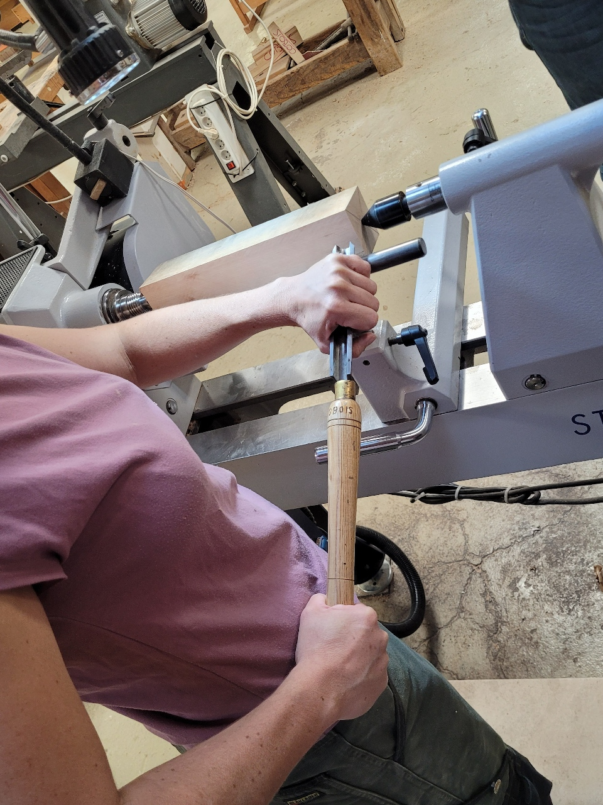
* Utiliser tout le corps pour bouger.
* Toujours être en mouvement.

Pour bien couper, et non défoncer, il faut **talonner** :
c'est à dire que l'on incline la gouge de manière à ce que son talon soit en contact avec la surface à usiner.

### Orientation de la gouge

* **Gouge ouverte** : Gorge vers le haut, prend plus de copeaux.
* **Gouge fermée** : Gorge à 90° vers la gauche ou la droite, ne coupe plus.

## Opérations de tournage

### Mettre à rond / cylindrer

#### Mise en place

1. Monter pointe et contre-pointe sur le tour.
1. Trouver le centre de chaque bout de la pièce à tourner.
   * Pour les pièces à section rectangulaire, tracer les diagonales.
   * Pour les sections irrégulière (ex. branches), le faire à l'oeil.
1. Poinçonner l'empreinte à chaque bout de la pièce à tourner, avec un centreur.
   * S'assurer de bien marquer la croix sur l'extrémité destinée à la pointe.
1. Fixer la pièce de bois entre les pointes :
   * Approcher la poupée-mobile sans rentrer dans la pièce.
   * Verrouiller le corps de la poupée-mobile sur le banc.
   * Approcher la contre-pointe avec le volant, en s'assurant d'aligner les empreintes.
   * Vérouiller la glissière de la contre-pointe avec la manette.
1. Positionner le porte-outil, proche de la pièce :
   * Si la pièce est plus longue que le porte-outile, commencer par le positionner côté poupée-mobile.
   * S'assurer que le porte-outil dépasse bien de la pièce côté sortie de la gouge.
   * Son bati (partie mobile sur le banc) doit être perpendiculaire au banc.
   * Vérifier que la rotation complète de la pièce n'est pas entravée.
1. Positionner l'arrête haute du porte-outil 5 mm en dessous de l'axe de rotation.
   > :warning: La hauteur à adopter dépend de l'outil. Pour la vérifier, poser l'outil à l'horizontal sur le porte-outil : son tranchant doit être à la hauteur de l'axe.

#### Usinage

1. Mettre en route le tour.
   > :warning: Ne pas rester en face de la pièce lors de la mise en route pour éviter les projections.
   * Etre prêt à arrêter le tour si la pièce touche / ne tient pas.
1. Utiliser la _gouge à dégrossir_, inclinée à 45°.
   > :warning: Toujours avancer, ne jamais rester sur place.
   1. Au début, on arrache : coupe avec le tranchant de l'outil, sans talonner.
      * Le bruit et irrégulier, lié à la section non-circulaire de la pièce.
   1. Ensuite, on coupe en venant chercher à appuier le talon de la gouge sur la surface devenue lisse.
  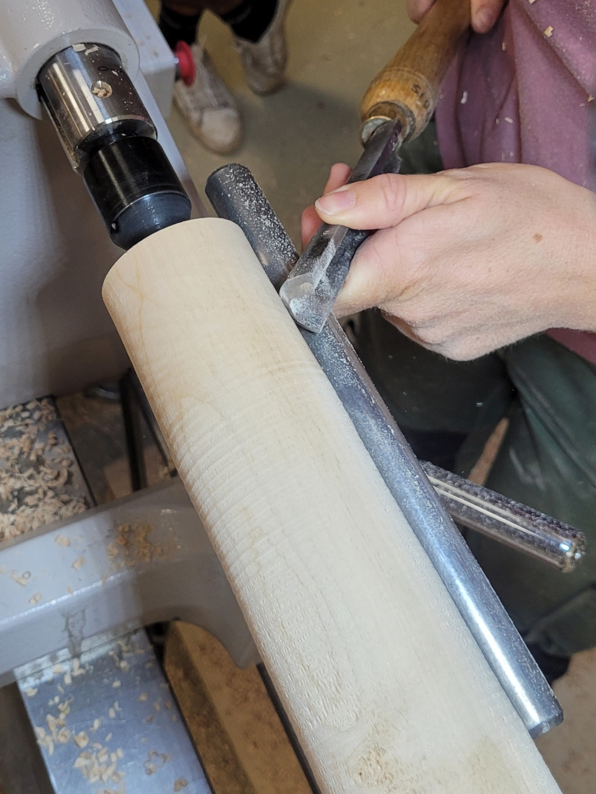

Au fur et à mesure de l'usinage, repositionner le porte-outil toujours au plus proche de la pièce.

### Profiler

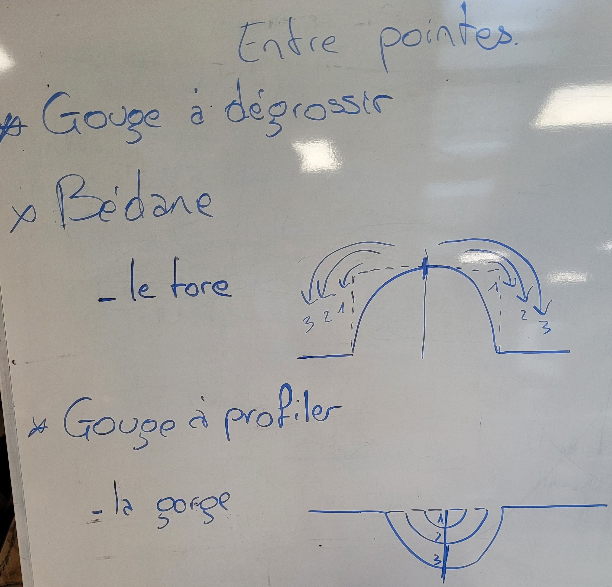

#### Tore

* Commencer par façonner les bords.
* Le mouvement va de l'intérieur vers l'extérieur, en passes successives (voir schéma).
  * A chaque passe, on peut aller chercher un peu plus vers le point haut (et faire une passe plus large).
  * Pendant le mouvement, la gouge passe de ouverte (début de la passe) à fermée (fin de la passe).
    * Au fur et à mesure que l'on ferme, il faut venir **relever la gouge** et **l'incliner** pour talonner.

#### Gorge

* Commencer par façonner le centre
* Le mouvement vas de l'extérieur vers l'intérieur, en passes successives (voir schéma).
  * A chaque passe, on peut aller débuter un peu plus vers l'extérieur (et faire une passe plus large).
  * Pendant le mouvement, la gouge passe de fermée (début de la passe) à ouverte (fin de la passe).
  > :warning: A la fin de la passe, la gouge doit se trouver à 45°, et on vient faire un mouvement de translation vers le haut en continuant de redresser pour la sortir sans accrocher (type "cuillère dans le yaourt").
    * Au début de la passe, la gouge est fermée, redressée, et inclinée pour talonner.

> :warning: Ne jamais continuer au delà du centre (point-bas) de la gorge. Un côté à la fois.

### Tourner un bois de "branche" / Faire une prise de mandrin

Pour une pièce à usiner de forme organique / très irrégulière, on tourne dans un **mandrin**.
Il faut donc commencer par usiner une **prise de mandrin** (qui se réalise entre-pointes):
* Profondeur inférieure à celle du mandrin.
  > :warning: Il ne faut pas que la pièce touche le fond du mandrin.
* Bords en biseau.
* Diamètre dans l'intervalle du mandrin.

<u>Prise de mandrin:</u>
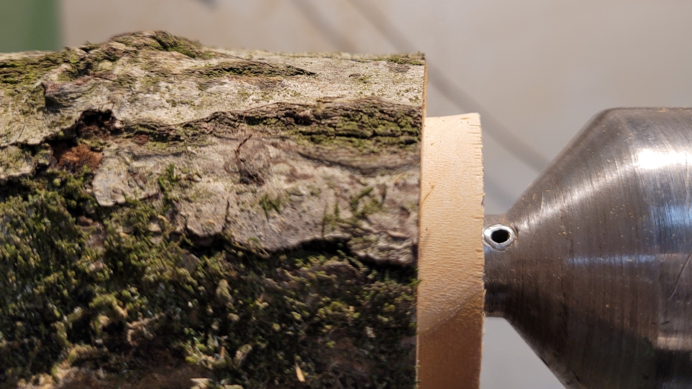

1. Poinçonner les extrémités et monter entre-pointes.
1. Au bédane, mettre à rond un peu moins que la largeur du bédane.
1. Tailler le biseau au bédane :
   * Incliner le bédane par un rotation sur l'axe du manche, qui doit s'appuyer sur l'arrête côté intérieur.
   * Usiner en gardant l'axe du manche bien perpendiculaire à l'axe du tour.
     * C'est le fait que le côté "haut" du tranchant se retrouve plus loin de l'axe qui permet de réaliser le biseau.

   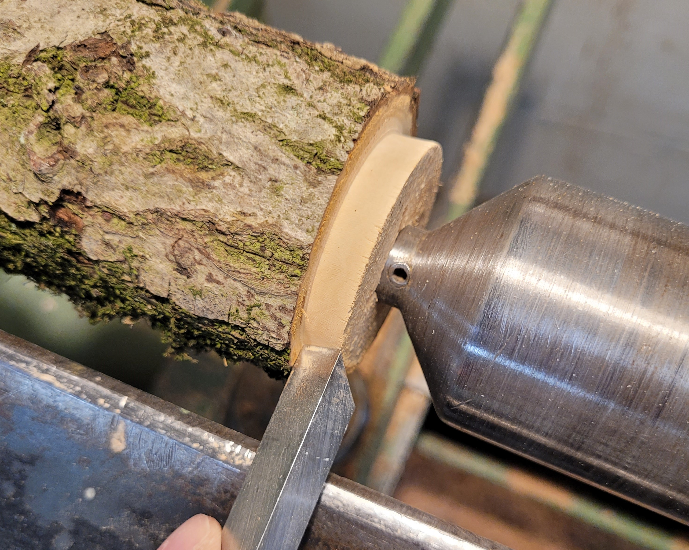

## Réalisations

### Pilon

1. Mettre à rond.
1. Prendre le bédane, réduire au 2 extrémités sur quelques centimètres.
  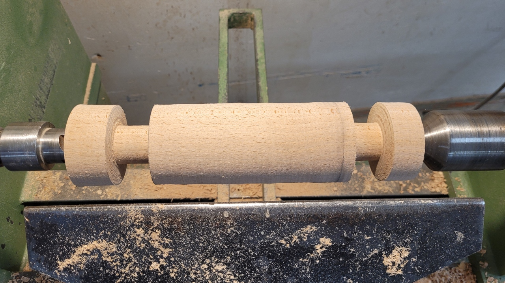
1. Faire une ébauche du profil en escalier.
  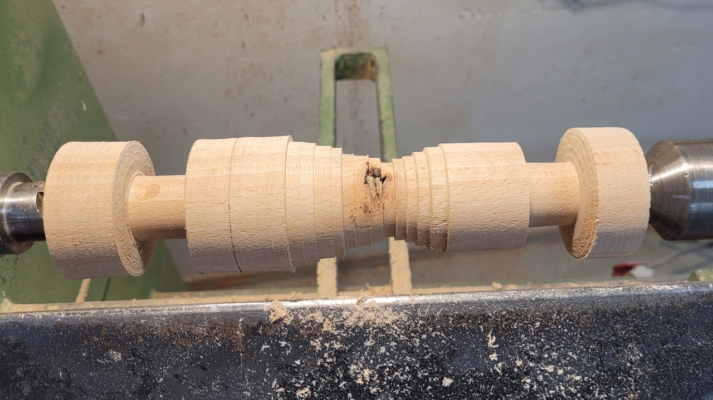
1. Prendre la gouge à profiler. Profiler les deux demi-tores des extrémités.
1. Profiler la gorge vers le centre, mais en restant demi-ouvert pour lisser les escaliers.
1. Effecter les deux jonctions de courbes, entre chaque demi-tore et la gorge.
   * Commencer un mouvement de tore du point haut vers le centre (ouvert -> fermé) qui transitionne en mouvement de gorge (fermé -> ouvert -> dégagement).
   * Cette étape à pour but de réaliser une transition continue entre les points hauts des demi-tores et la gorge.
  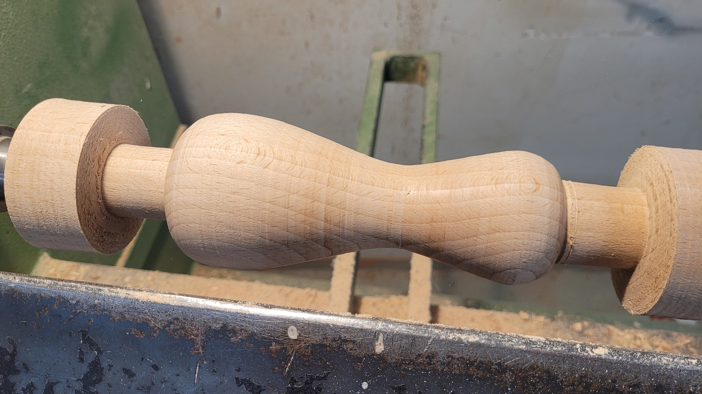
1. Au bédane, reduire les deux extrémités à ~1cm de diamètre.
   * Laisser ~2mm de marge de chaque côté du pilon.
  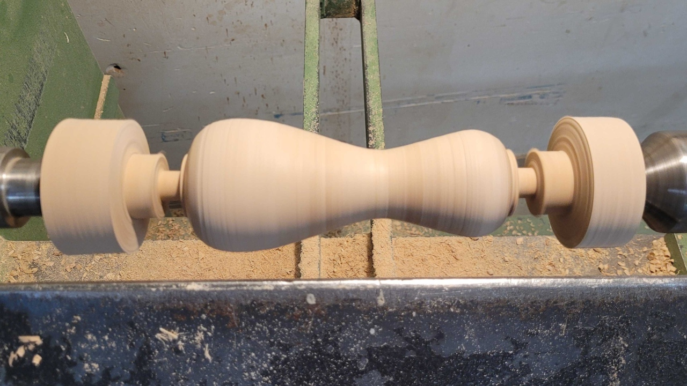
1. Avec la gouge à profiler, raccorder les demi-tores aux réductions (ce qui élimine les 2mm de marge).
1. Poncer
   > :warning: Enlever le porte-outil.

   > :warning: Porter une protection respiratoire.
   * Poncer par le dessous, il faut appliquer un pression assez importante.
   > **TIP** : Mettre des copeaux dans le papier abrasif pour isoler de la chaleur de frottement.
1. Couper (à 1 ou 2 mm) à la scie pour libérer le pilon.
1. Retirer l'excédent au lapidaire.
1. Finition au papier abrasif à la main.

### Champignon

Un champignon réalisé dans une branche, en gardant du flache sur la couronne du chapeau.

1. Réaliser une prise de mandrin.
1. Installer le mandrin sur le tour.
1. Monter la branche dans le mandrin.
   * Pousser la pièces dans le mandrin avec 1 doigt, serrer le mandrin.
  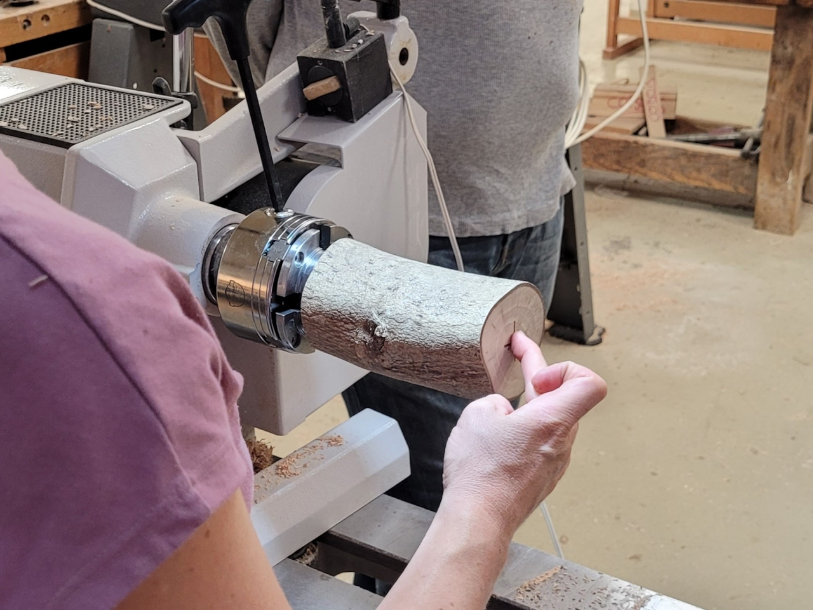
1. Positionner la contre-pointe
  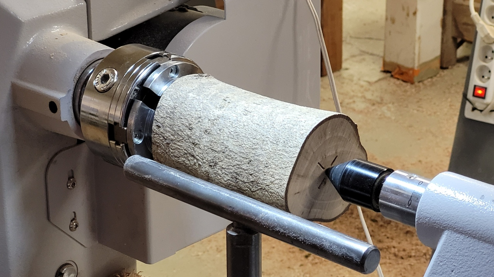
1. Au bédane, réduire 1/2 bédane de large côté contre-pointe, à ~15mm de diamètre. C'est au dessus du chapeau du champignon.
1. Gouge à profiler, effectuer un demi-tore vers le haut du chapeau (vers contre-pointe).
1. Au tronquoir, marquer le bas du chapeau.
   > :warning: toujours tronquer un peu plus large que le tronquoir pour ne pas le bloquer.
1. Gouge à profiler, arrondir **légèrement** l'arrête créée au tronquoir sous le chapeau.
  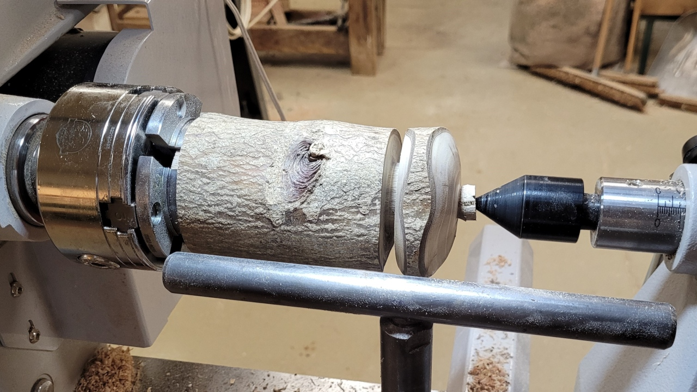
1. Au tronquoir, marquer le bas du pied.
1. Au bédane, esquisser le profil du pied avec marches d'escalier (le plus large côté poupée-fixe).
1. Au tronquoir, creuser l'intérieur du chapeau.
   * Effectuer des passes successives : commencer au centre (proche du pied), puis s'éloigner vers l'extérieur.
1. Profiler un demi-tore au bas du pied.
1. Profiler la gorge / demi-gorge vers le centre, mais en restant demi-ouvert pour lisser les escaliers.
1. Effecter la jonction de courbes, entre le point haut du pied et le fond de la gorge.
1. Eloigner la contre-pointe.
1. Resserrer le mandrin.
1. Gouge à profiler, retirer l'épaisseur laissée pour la prise de contre-pointe.
   * Positionner le porte-outil très proche, et sur la tangente du chapeau.
   * Faire le mouvement de demi-tore, en commençant presque fermé et en terminant complètement fermé.
   > :warning: C'est un étape délicate.
   > * Il faut attaquer demi-ouvert, presque fermé.
   > * Finir très doucement et totalement fermé quand on rejoint l'axe, la vitesse linéaire y est nulle.

   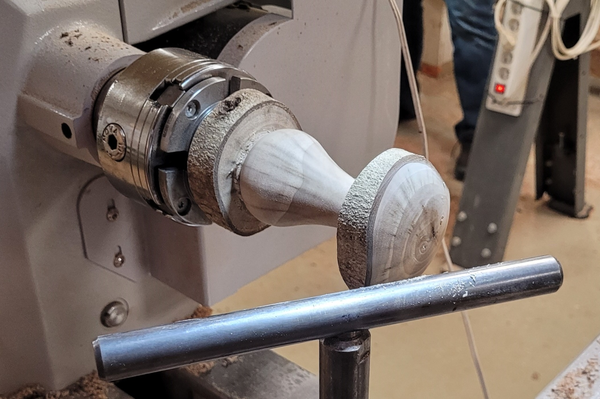
1. Poncer (voir pilon)
   > :warning: Enlever le porte-outil.
1. Couper sous le pied avec le tronquoir.
   * Lorsque la réduction atteint ~1cm, finir en tenant le tronquoir avec la main arrière seulement :
     * Caler le manche du tronquoir entre la hanche et l'avant bras.
     * Avec la main avant, tenir le pied.
